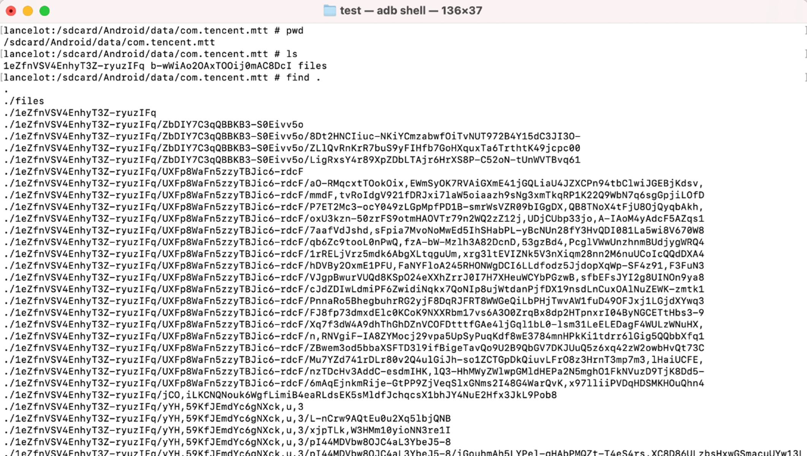

# transparent_encrypt_library
It's a library for transparent file encrypt/decrypt for cross-platform applications. Like Windows, Linux, macOS, Android, iOS. Only one library integrated into your application 

Demo effect on Android OS.

